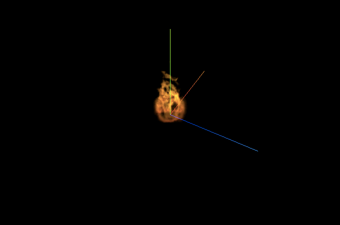

VolumetricFire is a JS lib ported from [Alfred Fuller's Real-time Procedural Volumetric Fire Demo](http://webgl-fire.appspot.com/html/fire.html) to Mesh class for three.js.



VolumetricFire does not use particle system. Because maximum `pointSize` of particles( a.k.a. VTF ) is limited and uncontrollable. Therefore, VolumetricFire is not limited by maximum size.

You can use fire meshes of VolumetricFire provides with `position.set()`, `rotate.set()`, `scale.set()` and other THREE.Mesh features.

## Usage

Include both [three.js](https://github.com/mrdoob/three.js/) and VolumetricFire.js
```
<script src="../lib/three.min.js"></script>
<script src="../VolumetricFire.js"></script>
```

Then, write JS code with three.js as usual. VolumetricFire class provides a fire mesh. you can add it to THREE.Scene instance.
```
<script>

// set path to texture images
// either relative or absolute path
VolumetricFire.texturePath = '../textures/';

var width = window.innerWidth;
var height = window.innerHeight;
var clock = new THREE.Clock();
var scene = new THREE.Scene();
var camera = new THREE.PerspectiveCamera( 60, width / height, .1, 1000 );
camera.position.set( 0, 0, 3 );
var renderer = new THREE.WebGLRenderer();
renderer.setSize( width, height );
document.body.appendChild( renderer.domElement );


var axisHelper = new THREE.AxisHelper( 5 );
scene.add( axisHelper );


var fireWidth  = 2;
var fireHeight = 4;
var fireDepth  = 2;
var sliceSpacing = 0.5;

var fire = new VolumetricFire(
  fireWidth,
  fireHeight,
  fireDepth,
  sliceSpacing,
  camera
);
scene.add( fire.mesh );
// you can set position, rotation and scale
// fire.mesh accepts THREE.mesh features
fire.mesh.position.set( 0, fireHeight / 2, 0 );


( function animate () {

  requestAnimationFrame( animate );

  var elapsed = clock.getElapsedTime();

  camera.position.set(
    Math.sin( elapsed * 0.1 ) * 8,
    Math.sin( elapsed * 0.5 ) * 10,
    Math.cos( elapsed * 0.1 ) * 8
  );
  camera.lookAt( scene.position );

  fire.update( elapsed );

  renderer.render( scene, camera );

} )();

</script>
```

- [example1: basic usage](http://yomotsu.github.io/VolumetricFire/examples/example1.html)
- [example2](http://yomotsu.github.io/VolumetricFire/examples/example2.html)
